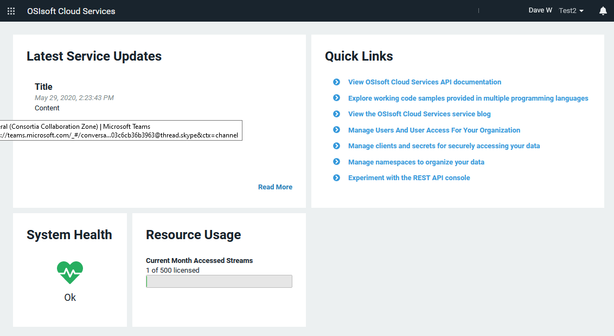
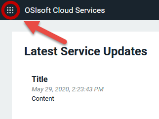
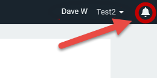
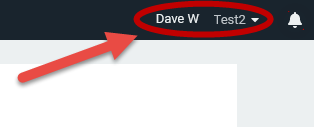

# Introduction to the portal interface

This topic provides a brief overview of the elements you use on the OCS portal interface.

When you first access the OCS portal interface, you see several panes providing information about the state of your system's health as well as quick links to popular documentation topics.

## OCS features

The menu icon at top left opens a menu from which you navigate to the different OCS features. You always have access to this menu wherever you are in the OCS portal.

Clicking the menu icon lists the following features:

> Data Management

Provides tools for setting up basic features of OCS, including tenants, connections to PI Systems, the Sequential Data Store (SDS), and metadata rules for data streams

> Data Collection

Provides mechanisms to bring data from multiple sources and systems into a namespace within OCS

> Visualization

Allows you to view data trends and use assets to set up digital twins of real world physical entities

> Analytics

Provides tools for shaping and querying large datasets

> Security

Allows you to specify identity providers for authentication and add users, roles, and clients to your tenant

> Developer Tools

Provides code samples, an API console, and an editor for OSIsoft Message Format (OMF)

> Support

Offers access to documentation, logs, support links, an OCS blog, and other useful information

## Feature pages

Clicking one of the menu items in the list of OCS features takes you to a page for that feature. Most pages consist of two panes:

- The left pane is where you perform the tasks associated with the OCS resource. For example, the left pane is where you add and edit the OCS resource or manage the permissions for the OCS resource.
- The right pane has one or more tabs:   

o	The Details tab contains additional information about your resource.
o	The Information tab provides documentation on how to perform tasks on the page.
o   Some resources have additional panes for other configuration tasks. 

## Notifications

At top right the View Notifications icon lists any OCS-generated notifications.

## User and tenant information

Also at top right, a drop-down menu provides information specific to your own user and tenant. This menu provides:

- Tenant Details
- Resource Usage
- My Profile

The menu also lets you enter feedback about OCS.

