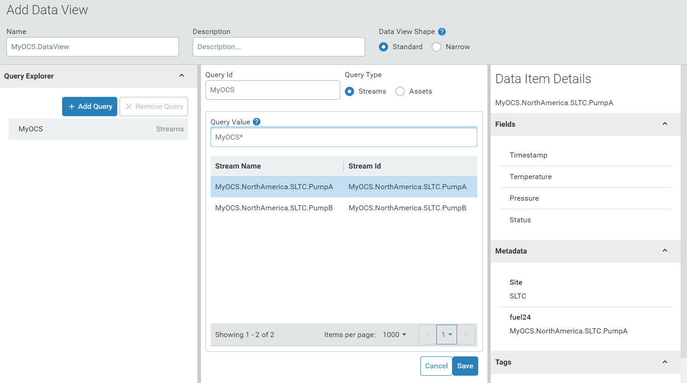
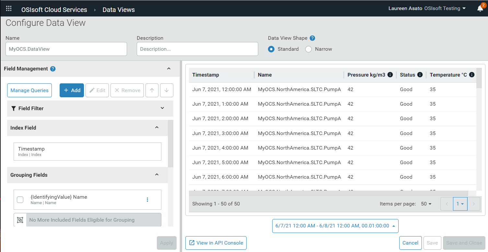
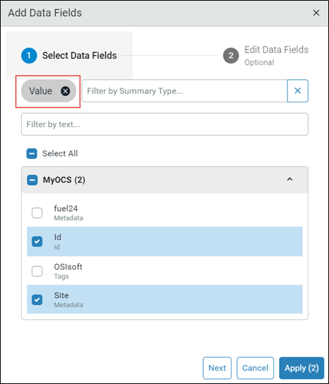
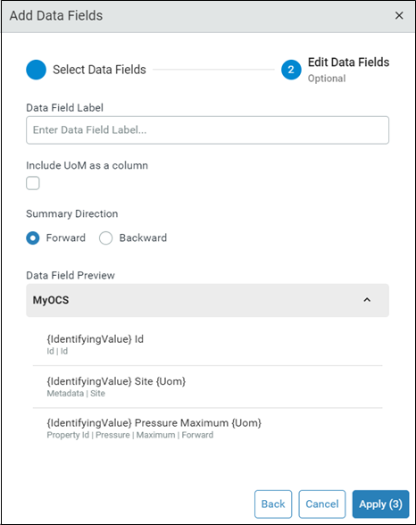
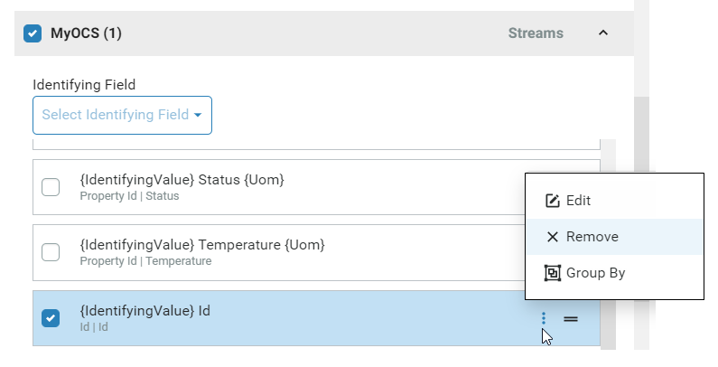
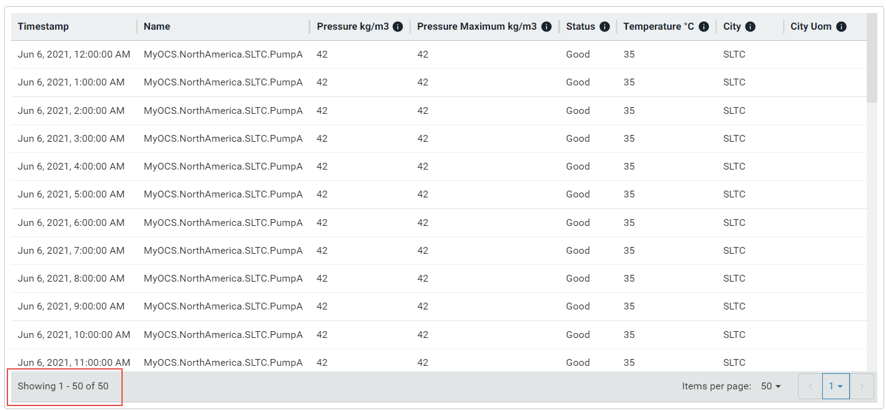
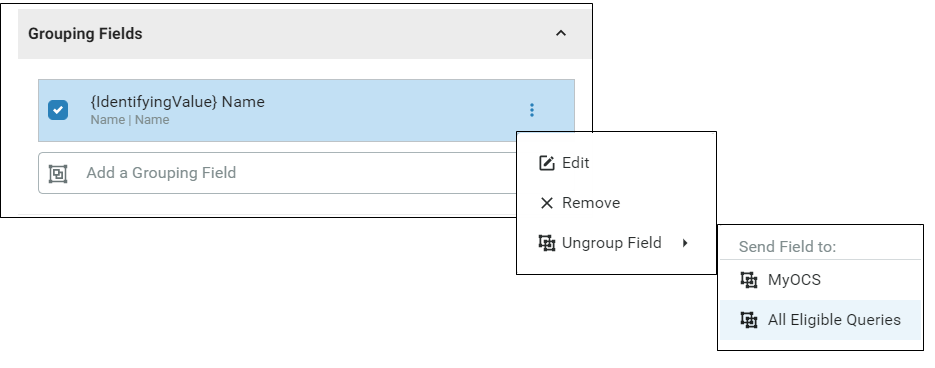
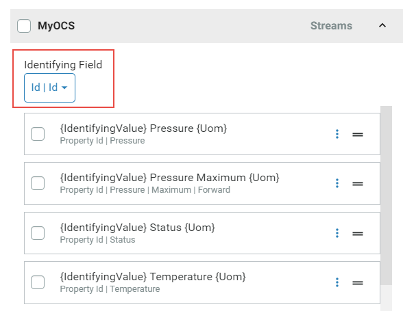
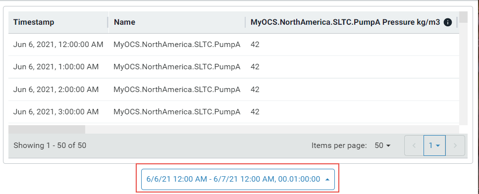

# Get started with data views

Data  views allow you to use OSIsoft Cloud Services (OCS) data in external applications for visualization, data science, and analytics. For more information about data views, see the following:

- [Data views](xref:ccDataViews)
- [PI Integrators counterpart](xref:ccDataViews#data-views-pi-integrators)
- [Data views best practices](xref:ccDataViews#data-views-bp)

## Prerequisites 

Follow the [Get started with streams](xref:gsStreams) procedure and create a second stream. Use the MyOCS.PumpState SDS type and name the stream *MyOCS.NorthAmerica.SLTC.PumpB*.

## Procedure

Follow the procedures below to create a data view and customize how the data is displayed and organized:

1. [Add the data view](#add-data-view)
2. [Change the data view shape](#change-shape)
3. [Add data fields to the data view](#add-data-fields)
4. [Remove data fields from the data view](#remove-data-fields)
5. [Rename a column heading](#rename-column-heading)
6. [Add stream names to the column headings](#add-stream-names)
7. [Change the order of the fields](#change-field-order)
8. [Specify the data view time range](#specify-time-range)

### Step 1: Add the data view

In this procedure, you add the streams that you want to include in your data view.

1. Click the  icon and click **Data Views** (under Analytics).

1. Click the **Namespace** selection button to open the `Select a Namespace` window. Click **MyOCS**.

1. In the toolbar, click **Add Data View**.

1. In the `Add Data View` pane, enter the following:

   - `Name` &ndash; **MyOCS.DataView**
   - `Description` &ndash; (Optional) Enter a description for the data view

5. In the middle pane, enter the following to search for streams that match the query value:

    - `Query Id` &ndash; **MyOCS**
    - `Query Value` &ndash; **MyOCS.***

    A list of streams that match the query value populates the table below the Query Value field. Two streams appear in the table:

    - MyOCS.NorthAmerica.SLTC.PumpA
    - MyOCS.NorthAmerica.SLTC.PumpB

    **Note:** You can define additional queries to include other streams. Click **Add Query** in the left pane.

    

6. Click **Save** to save the data view and open the `Configure Data View` page.

### The Configure Data View page

The following is a screen capture of the Configure Data View page.

 A preview of your data view results appears in a table in the right pane: 

   - By default, the left most column is the property used to index your streams, in this example, Timestamp. <!-- Am I getting this right? Is the indexed property always in the first column? --> 
   - The next column is Name, the name of the stream that contains the data displayed in this row.
   - The remaining columns are the value properties of the stream. The column name is the value property name, followed by the unit of measure, if applicable. In this example, the columns are named Pressure kg/m3, Status, and Temperature °C. 
   - Each row displays data for either the MyOCS.NorthAmerica.SLTC.PumpA stream or the MyOCS.NorthAmerica.SLTC.PumpB stream.

###  Step 2: Change the data view shape

By changing the data view shape, you can create a consistent table format for your data views. This procedure describes how to display the minimum properties or the full set of properties.

1. In the upper pane, find the **Data View Shape** field. Click **Narrow** and then click **Apply** in the lower right corner of the left pane. 

   

   The **Narrow** option removes all other columns from the table and displays only the following columns: Timestamp, Name, Field, and Value. The narrow data shape may be useful in ensuring a consistent table format for any data view. 

2. Click **Standard**, and then click **Apply** before continuing to the next step. 

   To edit the query or add additional streams with another query, click **Manage Queries.** This returns you to the `Manage Queries` page. 

3. After you are finished editing or adding a query, click **Apply** or **Cancel** to return to the `Configure Data View` page. 

### Step 3: Add data fields to the data view

In this procedure, you add the data fields to the data view and specify that the UOM is displayed.

1. In the left pane, under **Field Management**, click **Add** to open the `Add Data Fields` dialog.

   The fields for the MyOCS query are displayed.

1. Select the **Id** and **Site** checkboxes. 

    The number in the **Apply (2)** indicates the number of pending changes to the data fields and increments as you make additional changes.

3. Click the **X** in the **Value** box to remove the summary type filter. <!-- What is the Value filter filtering? And once deleted, how do you restore this filter -->

    

    The data fields list expands to include data summary options.

4. Select the **Pressure | Maximum** checkbox, and then click **Next** to go to the Edit Data Fields step.

    

    In this step, you can give the column a user-friendly name, different from the field name in the source. You can select the **Include UoM as a column** checkbox to add a column for the UoM of each data field, if it is applicable. Explore these options and preview the results. When you are finished, click **Back**.

5. Click **Apply** to add the three fields with the default options.

    Three new columns are added to the data view.

### Step 4: Remove data fields from the data view

In this procedure, you remove the Id field from the data view.

1. Select the **{IdentifyingValue} Id** checkbox under the MyOCS stream. 

1. Click the **More Options** menu and click **Remove**. 

     

1. In the `Remove Data Fields` dialog, click **Remove**.

     The **Id** column is removed from the preview. 

### Step 5: Rename a column heading

In this procedure, you change the Site column label. Before you begin, scroll through the preview and locate the Site column.

1. Select the **{IdentifyingValue}Site{UoM}** checkbox under the MyOCS stream.

1. Click the **More Options** menu, and click **Edit** to open the `Edit Data Fields` dialog.

1. In the `Data Field Label` field, enter **{identifyingValue} City**.

1. (Optional) Select the **Include UoM as a column** checkbox to add a column with the UoM for the data field.

1. Click **Apply**. 

    The column heading changes from *Site* to *City* and a City Uom column is added to the preview.
    
    <!-- We are inconsistent in how we capitalize UoM. In the UI, we use UoM, but in the column heading, it's Uom. I've also seen it used elsewhere in all caps, UOM. -->

### Step 6: Add stream names to the column headings

Notice the number of rows in the data view preview displayed at the bottom of the table. 

In this procedure, you remove the grouping field and decrease the total number of rows in the view. Then you add an `Id` field name to the column labels, making it easier to identify the stream associated with the data.

1. In the **Grouping Fields** section in the left pane, select the **{IdentifyingValue} Name** checkbox. 

1. Click the **More Options** menu, and click **Ungroup Field > All Eligible Queries**.

    <!-- This screen capture is probably not entirely necessary, but it's fun to create. -->

    

1. Click **Apply**.

    The data preview is changed in the following way:

    - The number of rows is reduced. There is one row, rather than multiple rows, for each timestamp.

    - Each row includes data for both streams. Each column label has a number appended to it. This distinguishes columns with the same labels, for example, Name.7 and Name.14.

      

      While this format reduces the number of rows, it makes it difficult to use because it is not clear which stream is associated with the column's data.

1. In the **Streams** section, click the **Identifying Field** dropdown list and click **Id | Id**. 

    

1. Click **Apply**.

    The column labels are prepended with the stream name. The *Name* column is prepended with the stream name *MyOCS.NorthAmerica.SLTC.PumpB*. 
    
    
    
    By default, data views are grouped by the stream name. However, if no grouping field is used, appending an identifying label to the column labels makes it easier to see which columns are associated with which stream. 

### Step 7: Change the order of the fields

In this procedure, you reorder the fields in the data view. 

1. In the **Grouping Fields** section, click the **{IdentifyingValue} City** field. 

2. Click the in the **Field Management** toolbar to move it to the top of the list, and click **Apply**.

    The Site column is moved to the left of the table.

### Step 8: Specify the data view time range 

The time range for the data in the table is displayed below the preview.

In this procedure, you set a default time range for the data view.

1. (Optional) Click the time range button to open the dialog where you can set the **Start Index (Local)**, **End Index (Local)**, and **Time Interval**. 

    

    The following describes how the time range settings are used with data view queries:

    - When you execute a data query, you must specify a start index, end index, and interpolation interval. If this is not specified, the data query results in an error.

    - Save the time range settings by selecting **Save Defaults with Data View**.  These saved settings are used, by default, when you execute a query.

    - You can override any defaults before the data view query is executed. 

1. Explore the different options to display your data. When you are satisfied with the data view preview, click **Save**. 

    This returns you to the Data Views page where you can execute your data view.

